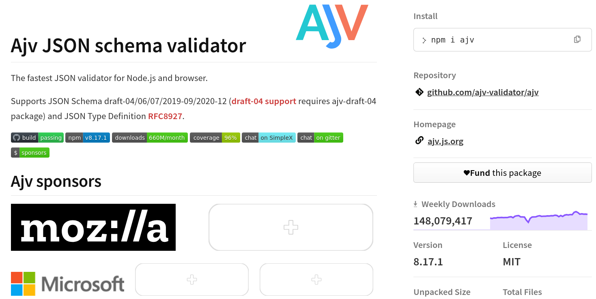

# VC Data Integrity Tutorial
Dr. Greg M. Bernstein and others?

- [<span class="toc-section-number">1</span>
  Introduction](#introduction)
  - [<span class="toc-section-number">1.1</span> Cooperating
    School/Community Clubs Use
    Case](#cooperating-schoolcommunity-clubs-use-case)
    - [<span class="toc-section-number">1.1.1</span> Why Bother with
      Verifiable Credentials?](#why-bother-with-verifiable-credentials)
- [<span class="toc-section-number">2</span> Club Credential
  Specification](#club-credential-specification)
  - [<span class="toc-section-number">2.1</span> Club Specific Domain
    Knowledge](#club-specific-domain-knowledge)
  - [<span class="toc-section-number">2.2</span> JSON for
    Everything!](#json-for-everything)
    - [<span class="toc-section-number">2.2.1</span> Data Modeling and
      Exchange: JSON](#data-modeling-and-exchange-json)
    - [<span class="toc-section-number">2.2.2</span> Data Validation:
      JSON-Schema](#data-validation-json-schema)
    - [<span class="toc-section-number">2.2.3</span> But What Does it
      mean: JSON-LD](#but-what-does-it-mean-json-ld)
  - [<span class="toc-section-number">2.3</span> Structure and Fields
    from the VC Data Model
    2.0](#structure-and-fields-from-the-vc-data-model-20)
  - [<span class="toc-section-number">2.4</span> Example Sport Specific
    Credential](#example-sport-specific-credential)
  - [<span class="toc-section-number">2.5</span> Creating the Club
    Specific `@context`](#creating-the-club-specific-context)
- [<span class="toc-section-number">3</span> Signatures, Keys, and
  Cryptosuites, oh my!](#signatures-keys-and-cryptosuites-oh-my)
  - [<span class="toc-section-number">3.1</span> Dealing with
    Cryptographic Keys](#dealing-with-cryptographic-keys)
    - [<span class="toc-section-number">3.1.1</span> Generating Key
      Pairs](#generating-key-pairs)
    - [<span class="toc-section-number">3.1.2</span> Sharing Public
      keys: Verification methods and
      DIDs](#sharing-public-keys-verification-methods-and-dids)
  - [<span class="toc-section-number">3.2</span> Choosing a
    Cryptosuite](#choosing-a-cryptosuite)
- [<span class="toc-section-number">4</span> Credential
  Issuance](#credential-issuance)
  - [<span class="toc-section-number">4.1</span> Proof Options:
    Additional Structure and Fields from Data Integrity
    1.0](#proof-options-additional-structure-and-fields-from-data-integrity-10)
- [<span class="toc-section-number">5</span> Credential
  Verification](#credential-verification)
- [<span class="toc-section-number">6</span> References](#references)

# Introduction

This document provides a tutorial introduction to W3C verifiable
credentials to allow non-profit school or community clubs to cooperate
with each in a timely and privacy enhancing way via the issuance and
verification of *verifiable credentials*. We will illustrating the use
of the following W3C **specifications**:

- Verifiable Credential Data Model 2.0 \[1\]
- Verifiable Credential Data Integrity 1.0 \[2\]
- JSON-LD-1.1 \[3\]

In addition we will go through the decision process in selecting the
appropriate **cryptosuite** from among:

- Data Integrity EdDSA Cryptosuites v1.0 \[4\]
- Data Integrity ECDSA Cryptosuites v1.0 \[5\]

## Cooperating School/Community Clubs Use Case

Suppose that we have two community hiking clubs (purely fictitious):
*The Arcata Tall Trees Hiking Club*
<a href="#fig-tall" class="quarto-xref">Figure 1 (a)</a> and the *White
Mountain Old Trees Hiking Club*
<a href="#fig-old" class="quarto-xref">Figure 1 (b)</a>. Both clubs
exists to promote the “great outdoors”, hiking safety, and comraderie.

<div id="fig-HikingClubs">

<div id="fig-tall">


(a) The tallest trees (Coast Redwoods)

</div>

<div id="fig-old">


(b) The oldest trees (Bristlecone pine)

</div>

Figure 1: Two Different Hiking Clubs

</div>

When teaching begining and intermediate website development to computer
science majors one of the authors of this tutorial would have students
create a website for a real or fictional school or community club of
their choosing, such as a hiking club, a guitar club, a cooking club
etc… They would develop this website from a simple static HTML page to a
full front-end/back-end server based application with logins for club
members and club officers with different views and club management
capabilities based on membership/officer status. A partially complete
example club is the [Bay Area Windsurf Foiling
Club](https://bawfc.grotto-networking.com/index.html). This tutorial
goes one step further and adds the ability to issue verifiable
credentials to its members so that they can participate in someway with
a different club that has some kind of reciprocity agreement.

To make the club interesting from a credential perspective the club
should certify knowledge or skills of a member. We assume the club has a
website and member data base of some sort. Clubs can get quite elaborate
with loaner equipment for members, events (open to all, open only to
members, members paid, etc.), rating system, required volunteer work,
etc. An example of such a club is the [Cal Sailing
Club](https://www.cal-sailing.org/) a university club that morphed into
a community club which has an extensive training program, collection of
boats and windsurfers, and runs a number of events every year.

### Why Bother with Verifiable Credentials?

Hiking club example. Member status. Knowledge certification. Skills
certification. Each club has separate member databases which for privacy
reasons do not share with the other club. If only a single club then a
“hike leader” could check the club database. Other mechanisms could
include one club sending email to another or calling the other. These
are not as timely as a current credential and sacrifice privacy. “Now we
know that he/she is participating with that other club…”

# Club Credential Specification

In this section we Start with domain specific knowledge of the club,
review the popular JSON data exchange “language” and tools, bring in
basic structure from the VC Data Model 2.0 \[1\], and then add a custom
“context” to define our club’s credential.

## Club Specific Domain Knowledge

As we will see in the following sections that the verifiable credentials
data model 2.0 \[1\] provides a well thought out structure for
credentials of any type. However, domain knowledge about the club is
needed to actually define the details of the credentials.

In this section I’m going to assume a wind sport club that includes
multiple disciplines (sailing, windsurfing, etc.) since at one time I
actually was a member of such a club.

One of the first questions that comes up is how best to organize the
credentials for the club? Given that this wind sport club has many
disciplines: (a) dinghy sailing, (b) keel boat sailing, (c) windsurfing,
(d) windsurf foiling, (e) wing foiling; should we have one credential
with lots of properties, or lots of separate credentials, or something
in between, e.g., membership credential and sport specific credentials?
Since verifiable credentials are kept in digital wallets rather than
physical wallets, more credentials from the same issuer isn’t
necessarily a big problem. For example the [Open Badges Specification
Spec Version 3.0](https://www.imsglobal.org/spec/ob/v3p0/) based on VC
DM 2.0 emphasizes a single *achievement* (see [Open Badges
Overview](https://www.1edtech.org/standards/open-badges)). While the
[Comprehensive Learner Record Standard Spec Version
2.0](https://www.imsglobal.org/spec/clr/v2p0) features a list of
*achievements*, e.g. all the courses completed on the way to a academic
degree.

My inclination is to have credentials specific to the club’s distinct
disciplines allowing for some redundancy if someone earns credentials in
multiple disciplines. Here are other notions:

1.  Membership: are their dues currently paid. Natural expiration date,
    covered by dues period. This would tend to be a much shorter period
    of time than for knowledge or skill expiration.
2.  Knowledge competency (written):
    1.  General Knowledge: Dock etiquet, Tides and Currents, Wind
        conditions, Boundaries for skill levels. Note: dock etiquet
        (shared use of docks) can change if some docks are out of
        service. Youth classes are being held, etc… The others would
        tend not to change much over time.
    2.  Sport and Equipment Specific Knowlege (Beginner, Intermediate,
        and Advanced)
        1.  Dinghy Sailing: Hoist usage, rigging of specific boat types.
        2.  Windsurfing: equipment familiarity (terminology), board set
            up. Rigging
        3.  Windsurf foiling: equipment familiarity, foil setup, rigging
        4.  Wing foiling: equipment familiarity, foil setup, wing setup
            and care.
    3.  Sport Specific Skills
        1.  Dinghy sailing: Junior Skipper (Docking, tacking, jibing,
            man-over-board, capsize and recovery)
        2.  Windsurfing: Beginner (board paddling to return to dock),
            Junior: Sail in 10mph or less wind around buoy X in cove and
            return to dock; Intermediate: sail in 10-15mph wind around
            buoy Y and return; Advanced: Sail in 15-25mph wind around
            buoy Z and return.
        3.  Windsurf foiling: must be *advanced* windsurfer.
            Intermediate sustained foiling for 30 seconds or more.
            Advanced: demonstrate successful foiling jibe. Distance
            cruising from Berkeley: (a) Treasure Island, (b) R2 Buoy
            (above TI), (c) R4 Buoy (off Angel Island), (d) Blossom Rock
            Buoy, (e) Alcatraz rounding, (f) Harding Rock Buoy, (f)
            Golden Gate Bridge (and back!).
        4.  Wing foiling: etc…

Now there are also a number of things a club might need to know about
you that do **not** need to be in a credential such as (a) phone number,
(b) address, (c) emergency contact information, (d) student status, etc…

## JSON for Everything!

### Data Modeling and Exchange: JSON

[JSON](https://www.json.org/json-en.html):

> JSON (JavaScript Object Notation) is a lightweight data-interchange
> format. It is easy for humans to read and write. It is easy for
> machines to parse and generate. It is based on a subset of the
> JavaScript Programming Language Standard ECMA-262 3rd Edition -
> December 1999. JSON is a text format that is completely language
> independent but uses conventions that are familiar to programmers of
> the C-family of languages, including C, C++, C#, Java, JavaScript,
> Perl, Python, and many others. These properties make JSON an ideal
> data-interchange language.

JSON is the text based data “lingua franca” for the web. I would teach
this early (week 4) in a first web programming class for CS majors. See
[JSON
Slides](https://www.grotto-networking.com/WebsiteDevelopment/files/lectures/Misc/JSON.html#/title-slide).

<a href="#lst-JSONVC" class="quarto-xref">Listing 1</a> is an example of
an JSON based credential from \[1\]:

<div id="lst-JSONVC">

Listing 1: Simple verifiable credential in JSON format.

``` javascript
{
  "@context": [
    "https://www.w3.org/ns/credentials/v2",
    "https://www.w3.org/ns/credentials/examples/v2"
  ],
  "id": "http://university.example/credentials/58473",
  "type": ["VerifiableCredential", "ExampleAlumniCredential"],
  "issuer": "did:example:2g55q912ec3476eba2l9812ecbfe",
  "validFrom": "2010-01-01T00:00:00Z",
  "credentialSubject": {
    "id": "did:example:ebfeb1f712ebc6f1c276e12ec21",
    "alumniOf": {
      "id": "did:example:c276e12ec21ebfeb1f712ebc6f1",
      "name": "Example University"
    }
  }
}
```

</div>

### Data Validation: JSON-Schema

JSON is great for modeling almost any data structure imaginable. However
most applications only wants certain types of data in a particular
format, i.e., a small subset of possible JSON structures and content.
Typically the structure and type of data is specified by a ***schema***
of some kind.

From [JSON-Schema](https://json-schema.org/):

> While JSON is probably the most popular format for exchanging data,
> JSON Schema is the vocabulary that enables JSON data consistency,
> validity, and interoperability at scale. JSON Schema is a declarative
> language for annotating and validating JSON documents’ structure,
> constraints, and data types

In addition a JSON-Schema is specified via JSON! I Would teach this in a
second web development course for use in data validation. [JSON-Schema
Slides](https://www.grotto-networking.com/WebsiteDevelopment/files/lectures/Misc/JSON-Schema.html).

I use JSON-Scheme in multiple places in my open source [VC
interoperability test
server](https://github.com/Wind4Greg/Server-for-VCs).
<a href="#lst-Schema" class="quarto-xref">Listing 2</a> shows an example
that does some basic checks on a verifiable credential.

<div id="lst-Schema">

Listing 2: Basic Schema to check a credential.

``` javascript
{
     "$id": "https://grotto-networking.com/simple-credential.schema.json",
     "title": "UnsignedCredential",
     "description": "A basic credential validator, data model v1.1 or v2.0",
     "type": "object",
     "properties": {
          "@context": {
               "type": "array",
               "items": {
                    "type": ["string", "object"]
               }
          },
          "id": {
               "type": "string",
               "format": "uri"
          },
          "type": {
               "type": ["string", "array"]
          },
          "credentialSubject": {
               "type": ["object", "array"]
          },
          "issuer": {
               "anyOf": [
                    {
                         "type": "string",
                         "format": "uri"
                    },
                    {
                         "type": "object",
                         "properties": {
                              "id": {
                                   "type": "string",
                                   "format": "uri"
                              }
                         },
                         "required": ["id"]
                    }
               ]
          },
          "credentialStatus": {
               "type": "object",
               "properties": {
                    "id": {
                         "type": "string",
                         "format": "uri"
                    },
                    "type": {
                         "type": ["string", "array"]
                    }
               },
               "required": ["type"]
          }
     },
     "required": ["@context", "type", "credentialSubject", "issuer"]
}
```

</div>

To actually perform checks of JSON document against a JSON-Schema,
optimized code libraries are used. I use and would have my students use
[npm: AJV](https://www.npmjs.com/package/ajv). In the figure below we
show the [NPM](https://www.npmjs.com/package/ajv) page for AJV, as you
can see from the weekly download numbers (100M+) JSON-Schema for input
validation is extremely popular.



### But What Does it mean: JSON-LD

From \[3\]: In addition to all the features JSON provides, JSON-LD
introduces:

- a universal identifier mechanism for JSON objects via the use of IRIs,
- a way to disambiguate *keys* shared among different JSON documents by
  mapping them to IRIs via a **context**,
- a mechanism in which a value in a JSON object may refer to a resource
  on a different site on the Web,
- the ability to annotate strings with their language,
- a way to associate datatypes with values such as dates and times,
- and a facility to express one or more directed graphs, such as a
  social network, in a single document.

Let’s focus on the second bullet “a way to disambiguate keys”. Consider
the credential for a “mystery club” shown in
<a href="#lst-Poles" class="quarto-xref">Listing 3</a>.

<div id="lst-Poles">

Listing 3: What kind of poles?

``` javascript
{
  "@context": [
    "https://www.w3.org/ns/credentials/v2",
    "https://www.MysteryClub.org/ns/credentials"
  ],
  "id": "http://university.example/credentials/58473",
  "type": ["VerifiableCredential", "MysteryClubEquipmentCredential"],
  "issuer": "did:example:2g55q912ec3476eba2l9812ecbfe",
  "validFrom": "2010-01-01T00:00:00Z",
  "credentialSubject": {
    "id": "did:example:ebfeb1f712ebc6f1c276e12ec21",
    "equipment": {
      "id": "did:example:c276e12ec21ebfeb1f712ebc6f1",
      "poles": "Some kind of pole"
    }
  }
}
```

</div>

In <a href="#lst-Poles" class="quarto-xref">Listing 3</a> we see that
“mystery club” has issued a credential about *equipment* to a
*credential subject*. We see that subject has a key denoted *poles*. But
what does this mean? (a) hiking poles, (b) treking poles, (c) spinaker
pole, (d) poles for pole-vaulting, (e) alpine ski poles, (f) cross
country ski poles, (g) gondolier pole, etc… What we are missing is
*context*! Figuratively and literally JSON-LD enables us to clearly
define what our *terms* mean via a `@context` which is a JSON document
that maps *keys* to long form, unique terms that can be documented. In
the following we’ll look at keys/terms that we get from the VC Data
Model 2.0 *context* and the Data Integrity 1.0 *context*, then we’ll
define a custome context for our club.

## Structure and Fields from the VC Data Model 2.0

The VC Data Model 2.0 \[1\] provides us with the following required and
optional structure as shown below. Note that the *comments* `//` are not
legal JSON syntax but are included here to explain the contents in a
compact manner. As seen in
<a href="#lst-VCDMAnnotated" class="quarto-xref">Listing 4</a> below:

<div id="lst-VCDMAnnotated">

Listing 4: Annotated VC Data Model example.

``` javascript
{
  "@context": [
    "https://www.w3.org/ns/credentials/v2",
    "https://www.mysailclub.org/ns/credentials" // Our context will go here
  ],
  "id": "http://university.example/credentials/58473", // optional, id of the VC
  "name": "The name of this credential", // optional
  "description": "A description of the credential", // optional
  "type": ["VerifiableCredential", "WaterClubCredential"], // required
  "issuer": { // required, Specify the issuer nicely
    "id": "https://mysailclub.org", // club IRI (but also URL)
    "name": "My Wind Sports Club", // issuer name
    "description": "A public or school based wind sports club." // optional issuer desc
  },
  "validFrom": "2010-01-01T00:00:00Z", // optional
  "validUntil": "2020-01-01T19:23:24Z", // optional
  "credentialSubject": { // required
    "id": "did:example:ebfeb1f712ebc6f1c276e12ec21", // optional, id of the subject
    // Here is where all the custom stuff will go
  }
}
```

</div>

## Example Sport Specific Credential

I’m going to work somewhat backwards and will start with a fairly rich
example for the wind sport discipline of “windsurf foiling” and then use
that to guide the development of the corresponding `@context`. My first
attempt is shown in
<a href="#lst-Windsurf" class="quarto-xref">Listing 5</a>.

<div id="lst-Windsurf">

Listing 5: Windsurf foiling (sport) specific credential.

``` javascript
{
  "@context": [
    "https://www.w3.org/ns/credentials/v2",
    "https://bawfc.grotto-networking.com/credentials" // Where I should be a copy of the context
  ],
  "name": "Bay Area Windsurf Foiling Credential",
  "description": "Denotes membership, knowledge, and skills in windsurf foiling",
  "type": ["VerifiableCredential", "WindFoilCredential"],
  "issuer": { // Specify the issuer nicely
    "id": "https://bawfc.grotto-networking.com", // club IRI (but also URL)
    "name": "Bay Area Windsurf Foiling Club", // issuer name
    "description": "Not a real club, but real information" // issuer desc
  },
  // "validFrom": "2010-01-01T00:00:00Z",  // Not using TMI
  // "validUntil": "2020-01-01T19:23:24Z", // Not using different parts expire differently
  "credentialSubject": {
    // "id": "did:example:ebfeb1f712ebc6f1c276e12ec21", // not using
    // Here is where all the custom stuff will go
    "membership": // Related to dues
        {"start": "2025-03-01T00:00:00Z"
        "end": "2025-10-31T00:00:00Z"},
    "knowledge": [ {"topic": "DockEtiquette", "date": "1984-01-01T00:00:00Z"}
        {"topic": "TidesAndCurrents", "date": "2010-01-01T00:00:00Z"},
        {"topic": "WindPatterns", "date": "2010-01-01T00:00:00Z"},
        {"topic": "LandMarksBuoys", "date": "2010-01-01T00:00:00Z"},
        {"topic": "BigBoatsFerries", "date": "2010-01-01T00:00:00Z"}
    ],
    "skills": [{"name": "Rigging", "date":"2010-01-01T00:00:00Z"},
        {"name": "FoilSetup", "date": "2017-01-01T00:00:00Z"}
    ],
    "distanceAchiements": [{"name": "TI", "date": "2010-01-01T00:00:00Z"},
        {"name": "R2", "date": "2011-01-01T00:00:00Z"}
    ]
  }
}
```

</div>

## Creating the Club Specific `@context`

The above example credential may need a bit of clean up. The `name` key
may not be able to be redefined. In general every term (key) used in our
example and not part of the VC DM2 needs to be defined in our club
specific context. These include: *membership*, *start*, *end*,
*knowledge*, *topic*, *date*, *skills*, *name*, *distanceAchiements*.
Note that I’ve reused *name* and *date* in multiple places. Is this bad?

I was getting errors on redefining *name* so revised the example
credential from
<a href="#lst-Windsurf" class="quarto-xref">Listing 5</a> to look like
that shown in
<a href="#lst-Windsurf2" class="quarto-xref">Listing 6</a>.

<div id="lst-Windsurf2">

Listing 6: Windsurf foiling (sport) specific credential again.

``` json
{
  "@context": [
    "https://www.w3.org/ns/credentials/v2",
    "https://bawfc.grotto-networking.com/credentials"
  ],
 "name": "Bay Area Windsurf Foiling Credential",
  "description": "Denotes membership, knowledge, and skills in windsurf foiling",
  "type": ["VerifiableCredential", "WindFoilCredential"],
  "issuer": {
    "id": "https://bawfc.grotto-networking.com",
    "name": "Bay Area Windsurf Foiling Club",
    "description": "Not a real club, but real information!"
  },
  "credentialSubject": {
    "type": ["Member", "WindsurfFoiler"],
    "membership":
        {"start": "2025-03-01T00:00:00Z", "end": "2025-10-31T00:00:00Z"},
    "knowledge": [ {"topic": "DockEtiquette", "date": "1984-01-01T00:00:00Z"},
        {"topic": "TidesAndCurrents", "date": "2010-01-01T00:00:00Z"},
        {"topic": "WindPatterns", "date": "2010-01-01T00:00:00Z"},
        {"topic": "LandMarksBuoys", "date": "2010-01-01T00:00:00Z"},
        {"topic": "BigBoatsFerries", "date": "2010-01-01T00:00:00Z"}
    ],
    "skills": [{"skill": "Rigging", "date":"2010-01-01T00:00:00Z"},
        {"skill": "FoilSetup", "date": "2017-01-01T00:00:00Z"}
    ],
    "distanceAchievements": [{"landmark": "TI", "date": "2010-01-01T00:00:00Z"},
        {"landmark": "R2", "date": "2011-01-01T00:00:00Z"}
    ]
  }
}
```

</div>

Giving every *key*/*term* I introduced a unique URI and a bit of extra
info produced my first club specific context shown in
<a href="#lst-ContextV1" class="quarto-xref">Listing 7</a>. To quickly
check for errors I started with this context “embedded” in the example
credential and then checked it with the [JSON-LD
Playground](https://json-ld.org/playground/).

<div id="lst-ContextV1">

Listing 7: Windsurf foiling specific context version 1.

``` json
{
    "@context": {
        "Member": "https://bawfc.grotto-networking.com/cred/#Member",
        "WindsurfFoiler": "https://bawfc.grotto-networking.com/cred/#Member",
        "membership": "https://bawfc.grotto-networking.com/cred/#membership",
        "knowledge": {
            "@id": "https://bawfc.grotto-networking.com/cred/#knowledge",
            "@container": "@set"
        },
        "skills": {
            "@id": "https://bawfc.grotto-networking.com/cred/#skills",
            "@container": "@set"
        },
        "distanceAchiements": {
            "@id": "https://bawfc.grotto-networking.com/cred/#distanceAchiements",
            "@container": "@set"
        },
        "start": {
            "@id": "https://bawfc.grotto-networking.com/cred/#skills",
            "@type": "http://www.w3.org/2001/XMLSchema#dateTime"
        },
        "end": {
            "@id": "https://bawfc.grotto-networking.com/cred/#skills",
            "@type": "http://www.w3.org/2001/XMLSchema#dateTime"
        },
        "topic": "https://bawfc.grotto-networking.com/cred/#topic",
        "date": {
            "@id": "https://bawfc.grotto-networking.com/cred/#skills",
            "@type": "http://www.w3.org/2001/XMLSchema#dateTime"
        },
        "skill": "https://bawfc.grotto-networking.com/cred/#skill",
        "landmark": "https://bawfc.grotto-networking.com/cred/#landmark"
    }
}
```

</div>

We can use “type specific” subcontexts to better reflect the separation
between a generic *Member* and a *WindsurfFoiler* as shown in
<a href="#lst-ContextV2" class="quarto-xref">Listing 8</a>.

<div id="lst-ContextV2">

Listing 8: Windsurf foiling specific context version 2.

``` json
{
    "@context": {
        "@protected": true,
        "Member": {
            "@id": "https://bawfc.grotto-networking.com/cred/#Member",
            "@context": {
                "membership": "https://bawfc.grotto-networking.com/cred/#membership"
            }
        },
        "WindsurfFoiler": {
            "@id": "https://bawfc.grotto-networking.com/cred/#WindsurfFoiler",
            "@context": {
                "knowledge": "https://bawfc.grotto-networking.com/cred/#knowledge",
                "skills": "https://bawfc.grotto-networking.com/cred/#skills",
                "distanceAchiements": "https://bawfc.grotto-networking.com/cred/#distanceAchiements"
            }
        },
        "start": {
            "@id": "https://bawfc.grotto-networking.com/cred/#start",
            "@type": "http://www.w3.org/2001/XMLSchema#dateTime"
        },
        "end": {
            "@id": "https://bawfc.grotto-networking.com/cred/#end",
            "@type": "http://www.w3.org/2001/XMLSchema#dateTime"
        },
        "topic": "https://bawfc.grotto-networking.com/cred/#topic",
        "date": {
            "@id": "https://bawfc.grotto-networking.com/cred/#date",
            "@type": "http://www.w3.org/2001/XMLSchema#dateTime"
        },
        "skill": "https://bawfc.grotto-networking.com/cred/#skill",
        "landmark": "https://bawfc.grotto-networking.com/cred/#landmark"
    }
}
```

</div>

And we can further nest our definitions to reflect our design intent
with <a href="#lst-ContextV3" class="quarto-xref">Listing 9</a>.

<div id="lst-ContextV3">

Listing 9: Windsurf foiling specific context version 3.

``` json
{
    "@context": {
        "Member": {
            "@id": "https://bawfc.grotto-networking.com/cred/#Member",
            "@context": {
                "@protected": true,
                "membership": {
                    "@id": "https://bawfc.grotto-networking.com/cred/#membership",
                    "@context": {
                        "@protected": true,
                        "start": {
                            "@id": "https://bawfc.grotto-networking.com/cred/#start",
                            "@type": "http://www.w3.org/2001/XMLSchema#dateTime"
                        },
                        "end": {
                            "@id": "https://bawfc.grotto-networking.com/cred/#end",
                            "@type": "http://www.w3.org/2001/XMLSchema#dateTime"
                        }
                    }
                }
            }
        },
        "WindsurfFoiler": {
            "@id": "https://bawfc.grotto-networking.com/cred/#WindsurfFoiler",
            "@context": [
                {
                    "knowledge": {
                        "@id": "https://bawfc.grotto-networking.com/cred/#knowledge",
                        "@container": "@set",
                        "@context": {
                            "@protected": true,
                            "topic": "https://bawfc.grotto-networking.com/cred/#topic",
                            "date": {
                                "@id": "https://bawfc.grotto-networking.com/cred/#date",
                                "@type": "http://www.w3.org/2001/XMLSchema#dateTime"
                            }
                        }
                    }
                },
                {
                    "skills": {
                        "@id": "https://bawfc.grotto-networking.com/cred/#skills",
                        "@container": "@set",
                        "@context": {
                            "@protected": true,
                            "skill": "https://bawfc.grotto-networking.com/cred/#skill",
                            "date": {
                                "@id": "https://bawfc.grotto-networking.com/cred/#date",
                                "@type": "http://www.w3.org/2001/XMLSchema#dateTime"
                            }
                        }
                    }
                },
                {
                    "distanceAchiements": {
                        "@id": "https://bawfc.grotto-networking.com/cred/#distanceAchiements",
                        "@container": "@set",
                        "@context": {
                            "@protected": true,
                            "landmark": "https://bawfc.grotto-networking.com/cred/#landmark",
                            "date": {
                                "@id": "https://bawfc.grotto-networking.com/cred/#date",
                                "@type": "http://www.w3.org/2001/XMLSchema#dateTime"
                            }
                        }
                    }
                }
            ]
        }
    }
}
```

</div>

# Signatures, Keys, and Cryptosuites, oh my!

To “secure” a verifiable credential, i.e., to actually make a credential
verifiable, requires the use of a digital signature. [Digital
signatures](https://en.wikipedia.org/wiki/Digital_signature) are a
specific type of cryptographic primitive that uses *public-key*
cryptography. Two different keys are used in a digital signature system:
(1) a private key is used to sign data, (2) a public key is used to
verify the signature on the data.

## Dealing with Cryptographic Keys

A short list of references for dealing with cryptographic keys follows.

- [NIST SP 800-57 Part 1 Recommendation for Key Management: Part 1 –
  General](https://csrc.nist.gov/pubs/sp/800/57/pt1/r5/final) “This
  Recommendation provides cryptographic key-management guidance.”, This
  is ***the*** comprehensive reference and is frequently cited in other
  guides.
- [OWASP: Key Management Cheat
  Sheet](https://cheatsheetseries.owasp.org/cheatsheets/Key_Management_Cheat_Sheet.html)
- [OWASP: Secrets Management Cheat
  Sheet](https://cheatsheetseries.owasp.org/cheatsheets/Secrets_Management_Cheat_Sheet.html)

NIST SP 800-57 lists 19 different types of cryptographic keys. For
issuing credentials for out club we will only be concerned with their
first two types:

    1. Private signature key: Private signature keys are the private keys of asymmetric-key
    (public-key) key pairs that are used by public-key algorithms to generate digital signatures
    intended for long-term use. When properly handled, private signature keys can be used to
    provide source authentication and integrity authentication as well as support the non-
    repudiation of messages, documents, or stored data.
    2. Public signature-verification key: A public signature-verification key is the public key of
    an asymmetric-key (public-key) key pair that is used by a public-key algorithm to verify
    digital signatures that are intended to provide source authentication and integrity
    authentication as well as support the non-repudiation of messages, documents, or stored
    data.

It is important to note that our website will be using more than one set
of such key pairs and these must not be confused or reused. In
particular, for our website their with be a key pair used in
[HTTPS](https://en.wikipedia.org/wiki/HTTPS) service. This is completely
different from the key pair used in signing our credentials.

### Generating Key Pairs

In general the private and public portions of a key pair are generated
at the same time as shown in the code snippet

<div id="lst-KeyGen">

Listing 10: Simple generation of private and public key pair for a
particular cryptographic algorithm.

``` javascript
import {ed25519} from '@noble/curves/ed25519.js';
let { privateKey, publicKey } = ed25519.keygen();
```

</div>

The private portion of the key must be **protected** and never revealed!
It only needs to be known to our code that will actually run the signing
algorithm. The public portion needs to be distributed in a secure way so
that a verifier will have a high assurance that the public key is
actually for our club and not an imposter.

Note that you may see a number of different formats for the same key
information. In
<a href="#lst-KeyFormats" class="quarto-xref">Listing 11</a> we show
some common formats all for the same public/private pair.

<div id="lst-KeyFormats">

Listing 11: Different encodings for private and public keys.

``` javascript
{
    privateKeyHex: "4b49e4ec275c7590d39672508b2717c2dc1dc015e50a5d064732742413c810e0",
    publicKeyHex: "419d02f127a4703ee3e09d071a1ddf2bd8be891558c5023e64232dc7f255eda4",
    publicKeyMultibase: "z6MkisPQbQ4toWkXzY5C1Da76Ghc64DVe5ZU7DkMDjRtvqNj",
    privateKeyMultibase: "z3u2WHhiUqnajJreS8TQw2M57nMfjr7pD7pbme2M66U6BBgb",
    didKey: "did:key:z6MkisPQbQ4toWkXzY5C1Da76Ghc64DVe5ZU7DkMDjRtvqNj"
}
```

</div>

### Sharing Public keys: Verification methods and DIDs

This needs to be made available in a “secure maner”, don’t want a
malicious party to substitute in their public key and *impersonate* the
real issuer.

For testing purposes the [`did:key` DID
method](https://w3c-ccg.github.io/did-key-spec/) is the easiest to use
since the value of key is embedded in the DID method, e.g.,
`did:key:z6MkisPQbQ4toWkXzY5C1Da76Ghc64DVe5ZU7DkMDjRtvqNj` contains an
encoded verion of the actual public key value.

***Note*** per [section 3.12 of the did:key
spec](https://w3c-ccg.github.io/did-key-spec/#signature-method-creation-algorithm)
when using a `did:key` value in the proof options *verificationMethod*
field step 5 states to add a hash (#) character and then the multibase
value so a DID key of
`did:key:z6MkisPQbQ4toWkXzY5C1Da76Ghc64DVe5ZU7DkMDjRtvqNj` leads to a
`verificationMethod: "did:key:z6MkisPQbQ4toWkXzY5C1Da76Ghc64DVe5ZU7DkMDjRtvqNj#z6MkisPQbQ4toWkXzY5C1Da76Ghc64DVe5ZU7DkMDjRtvqNj"`
updated versions also allow the format:
`verificationMethod: "did:key:z6MkisPQbQ4toWkXzY5C1Da76Ghc64DVe5ZU7DkMDjRtvqNj#vm"`
which is less redundant. You may see both in the test vectors in the W3C
VC documents.

For deployment, since we already have a website, we can use the
[`did:web` DID method](https://w3c-ccg.github.io/did-method-web/) For
that we need a basic DID document such as that shown in
<a href="#lst-DIDdoc" class="quarto-xref">Listing 12</a>.

<div id="lst-DIDdoc">

Listing 12: Simple DID document.

``` json
{
  "@context": ["https://www.w3.org/ns/did/v1",
  "https://w3id.org/security/multikey/v1"],
  "id": "did:web:bawfc.grotto-networking.com",
  "assertionMethod": [{
      "id": "did:web:bawfc.grotto-networking.com#vm",
      "type": "Multikey",
      "controller": "did:web:bawfc.grotto-networking.com",
      "publicKeyMultibase": "z6MkisPQbQ4toWkXzY5C1Da76Ghc64DVe5ZU7DkMDjRtvqNj"
  }]
}
```

</div>

We should note that given a website that the [`did:webvh` DID
method](https://identity.foundation/didwebvh/v1.0/) can also be used and
contains enhanced functionality for dealing with key changes.

## Choosing a Cryptosuite

Basic review of digital signatures, public key cryptography. Concerned
with forgeries!

# Credential Issuance

## Proof Options: Additional Structure and Fields from Data Integrity 1.0

**Important** this also sets up the “proof options” that are used by the
DI cryptosuites.

# Credential Verification

# References

<div id="refs" class="references csl-bib-body" entry-spacing="0">

<div id="ref-VC-DM2.0" class="csl-entry">

<span class="csl-left-margin">\[1\]
</span><span class="csl-right-inline">M. Sporny, T. T. Jr, M. Jones, G.
Cohen, and I. Herman, “Verifiable credentials data model v2.0,” W3C,
Candidate Recommendation, Feb. 2025. Available:
<https://www.w3.org/TR/vc-data-model-2.0/></span>

</div>

<div id="ref-VC-DI1.0" class="csl-entry">

<span class="csl-left-margin">\[2\]
</span><span class="csl-right-inline">G. Bernstein, M. Sporny, D.
Longley, I. Herman, and T. T. Jr, “Verifiable credential data integrity
1.0,” W3C, Candidate Recommendation, Feb. 2025.</span>

</div>

<div id="ref-JSON-LD-1.1" class="csl-entry">

<span class="csl-left-margin">\[3\]
</span><span class="csl-right-inline">G. Kellogg, D. Longley, and P.-A.
Champin, “JSON-LD 1.1,” W3C, {W3C} Recommendation, Jul. 2020.</span>

</div>

<div id="ref-VC-DI-EdDSA" class="csl-entry">

<span class="csl-left-margin">\[4\]
</span><span class="csl-right-inline">T. T. Jr, M. Sporny, and G.
Bernstein, “Data integrity EdDSA cryptosuites v1.0,” W3C, Candidate
Recommendation, Feb. 2025.</span>

</div>

<div id="ref-VC-DI-ECDSA" class="csl-entry">

<span class="csl-left-margin">\[5\]
</span><span class="csl-right-inline">G. Bernstein, D. Longley, and M.
Sporny, “Data integrity ECDSA cryptosuites v1.0,” W3C, Candidate
Recommendation, Feb. 2025.</span>

</div>

</div>
